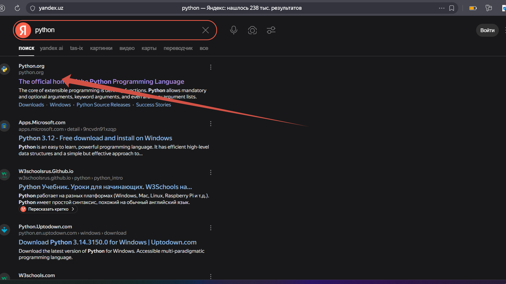
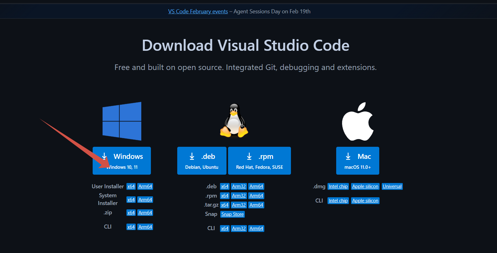
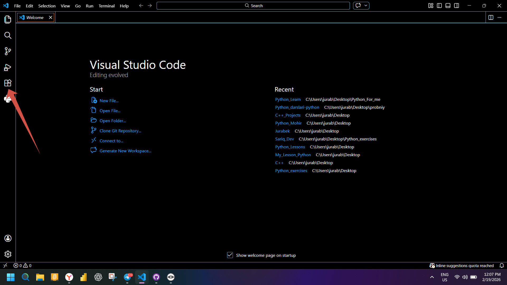

# Boshlash

**Kerakli dasturlar**

Ushbu bo'limda Python tilini o'rganish uchun kerak bo'ladigan dasturlarni o'rnatib olamiz. Ammo unutmang dastur ya'ni kodlarni yozish uchun yuzlab turli dasturlar bor va siz xohlasangiz boshqa dasturni ishlatishingiz mumkin.

**PYTHON**

Kod yozish uchun kompyuterimizga Python o'rnatilgan bo'lishi kerak. Buning uchun biz [PYTHON](https://www.python.org/) satyiga kiramiz va u yerda quyidagi rasmlardagidek dasturni o'rnatib olamiz.

Bunday qilishimizning asosiy sababi biz siz o'rganuvchi keyinchalik yana boshqa dasturlash tillarini o'rganishingizga qulay bo'lishini istadik va bunda biz ko'plab tillarni o'rganish va kod yozish uchun qulay bo'lgan dastur **vs code** yani visual studio code dasturini tanladik. Ammo agar sizda daasturni o'rnatish bilan bog'liq muammo bo'ladigan bo'lsa unda online [Replit.com](https://replit.com/~) saytidan ham kodlar yozish uchun foydalanishingiz mumkin.

Endi kompyuterimizni ochib unda saytiga kiramiz va bizni taxminan quyidagi oyna kutib oladi.

Pythonni yuklaganimizda bizda quyidagi belgi paydo bo'ladi.

Dasturni yuklab bo'lgach uni o'rnatsh ham juda oson

Diqqat qiling sizda ekraningizda **Add python.exe to PATH** belgilanmagan bo'ladi buni tasdiqlash belgisini qoldiring bu dasturning to'g'ri ishlashi uchun zarur bo'ladi. Demak **Install now** tugmasini bosishingiz kerka bo'ladi va dastur o'rnatish boshlanati bunda faqat **next** tugmasini bosib borsangiz bas

Endi kodlarni yozish uchun asosiy dastur [**vs code**](https://code.visualstudio.com/download) ni o'rnatib olamiz.

Sayt bog'lamasini tepada qoldirdim shuning uchun qidiruv rasmini qoldirmadim va ko'rsatilgan tugmani bosishingiz bilan sizning kompyuteringizda yuklash boshlanadi

Dastur ochilganida sizda **welcome** oyna ochiladi bu birinchi marta ochilgani uchun va bunda siz kerakli **extension** lar yani python kodlarini ishatish uchun qo'shimchalar yuklab olishingiz kerak bo'ladi.

Ko'rsatilgan **extension** larni yuklab olishingiz maqsadga muvofiq ko'riladi va endi siz kod yozishni boshlashingiz mumkin. Buning uchun **new file** tugmasini bosasiz va yangi file yaratish uchun nom berishingiz kerak bo'ladi.

Diqqat qiling filega nom berishda turli **'"/>** kabi belgilardan foydalanmang va file nomi oxirida **.py** qo'shib qo'ying bu python tilida yozilgan kod file larining kengayitmasi hisoblanadi.

Va endi kodingizni yozishingiz mumkin bo'ladi

Barcha dasturchilarning an'anasiga sodiq qolgan va o'zbek ekanimizni inobatga olgan holda **Salom Dunyo** kodini ishga tushiramiz. Agar sizda hammasi to'g'ri o'rnatilgan bo'lsa unda quyidagi natija chiqishi kerak va tabriklayman sizda bu o'xshagan bo'lsa.

