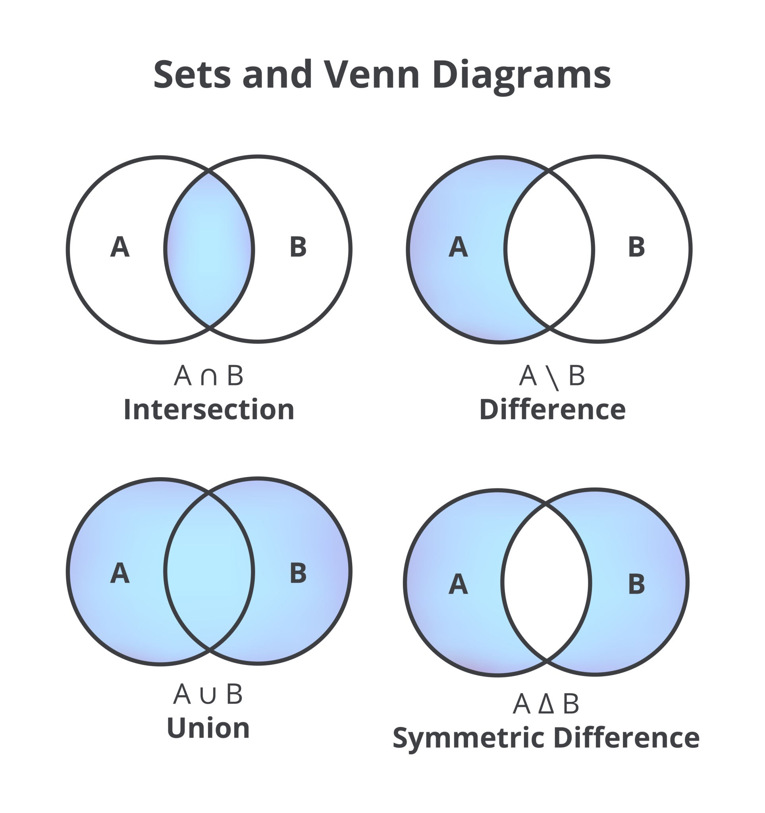

# Python-da Set 
Set (to'plam) — bu o'ziga xos xususiyatlarga ega bo'lgan ma'lumotlar turi. Uni tushunish uchun matematikadagi to'plamlar nazariyasini eslash kifoya.


Setning 3 ta asosiy qoidasi bor:

* Tartiblanmagan (Unordered): Elementlar qaysi tartibda kiritilsa, shunday saqlanmaydi.

* Takrorlanmas (Unique): Bir xil elementdan faqat bitta bo'lishi mumkin.

* O'zgaruvchan (Mutable): To'plamga element qo'shish yoki o'chirish mumkin, lekin uning ichidagi elementlar o'zgarmas (immutable) bo'lishi shart (masalan, list qo'shib bo'lmaydi).

#### Set yaratish
To'plam figurali qavslar { } yoki set() funksiyasi yordamida yaratiladi.


```python
mevalar = {"olma", "banan", "olcha", "olma"} 
print(mevalar) 
# Natija: {'olma', 'banan', 'olcha'}  --> "olma" takrorlangani uchun bittasi qoldi.
```

Eslatma: Bo'sh to'plam yaratish uchun {}  ishlatmang (chunki bu bo'sh lug'at - dict yaratadi), doim set() dan foydalaning.

#### Element qo'shish va o'chirish
* add(): Bitta element qo'shish.

* update(): Bir nechta element (yoki ro'yxat) qo'shish.

* remove() yoki discard(): Elementni o'chirish. (remove agar element bo'lmasa xato beradi, discard esa bermaydi).


```python
raqamlar = {1, 2, 3}
raqamlar.add(4)
raqamlar.update([5, 6, 7])
raqamlar.discard(2)
print(raqamlar) # {1, 3, 4, 5, 6, 7}
```

    {1, 3, 4, 5, 6, 7}
    

#### To'plamlar ustida matematik amallar
Setning eng kuchli tomoni — ikki to'plamni solishtirishdir.



| Amal nomi | Belgisi / Metodi | Vazifasi |
| :--- | :--- | :--- |
| **Birlashma (Union)** | \| yoki `.union()` | Ikkala to'plamdagi barcha elementlarni yig'adi. |
| **Kesishma (Intersection)** | \& yoki `.intersection()` | Faqat ikkalasida ham bor elementlarni oladi. |
| **Ayirma (Difference)** | \- yoki `.difference()` | Birinchisida bor, lekin ikkinchisida yo'q elementlar. |
| **Simmetrik ayirma** | \^ | Faqat bittasida bor elementlar (umumiy bo'lmaganlar). |


```python
a = {1, 2, 3, 4}
b = {3, 4, 5, 6}

print(a & b) # {3, 4} (Kesishma)
print(a | b) # {1, 2, 3, 4, 5, 6} (Birlashma)
print(a - b) # {1, 2} (Ayirma)
```

    {3, 4}
    {1, 2, 3, 4, 5, 6}
    {1, 2}
    

#### Qachon ishlatiladi?
Takrorlanishni yo'qotish: Ro'yxatdagi (list) dublikatlarni bitta qatorda o'chirmoqchi bo'lsangiz: list(set(my_list)).

A'zolikni tekshirish: Biror element to'plam ichida bor-yo'qligini tekshirish listga qaraganda million marta tezroq ishlaydi (Hashing hisobiga).

Taqqoslash: Ikki xil ma'lumotlar bazasidagi farqlarni tezda topishda.

Shu o'rinda nima uchun set kerak agar bizda boshqa ma'lumot turlari borku ro'yxat bilan ishlashning degan savolga javob berishga harakat qilamiz:

#### Dictionary va Set 
ma'lumot qidirish tezligi bo'yicha List va Tupledan o'nlab, hatto millionlab marta tezroq ishlashi mumkin.

Buning sababini oddiy hayotiy misol va texnik misolda ko'ramiz

#### 1. "Varaqlash" vs "Manzil" (Mantiqiy farq)
List va Tuple (Varaqlash): Tasavvur qiling, sizda 1000 sahifali kitob bor va siz undan biror so'zni qidiryapsiz. Siz 1-betdan boshlab oxirigacha birma-bir qarab chiqasiz. Agar qidirayotgan so'zingiz 999-betda bo'lsa, juda ko'p vaqt yo'qotasiz. Bunga dasturlashda $O(n)$ (chiziqli vaqt) deyiladi.Set va Dictionary (Manzil): Bu xuddi kitobning mundarijasi yoki lug'atga o'xshaydi. Siz "Olma" so'zini qidirmoqchi bo'lsangiz, hashing algoritmi sizga darrov "u 50-betda" deb manzilni ko'rsatadi. Siz to'g'ridan-to'g'ri o'sha betni ochasiz. Bunga $O(1)$ (doimiy vaqt) deyiladi.

2. Tezlikni amalda solishtirish
Keling, kichik bir test o'tkazamiz. Tasavvur qiling, bizda 1 millionta son bor va biz oxirgi sonni qidiryapmiz:

### Ma'lumot turlarining qidirish tezligi bo'yicha taqqoslanishi (1 mln element misolida)

| Ma'lumot turi | Qidirish mexanizmi | Tezlik (Complexity) | Izoh |
| :--- | :--- | :--- | :--- |
| **List** | Chiziqli qidiruv (Linear search) | $O(n)$ - Sekin | Har bir elementni birma-bir tekshiradi. |
| **Tuple** | Chiziqli qidiruv (Linear search) | $O(n)$ - Sekin | List bilan bir xil mexanizmda ishlaydi. |
| **Set** | Hashing (Hash table) | $O(1)$ - Juda tez | Hash-kod orqali element manzilini darrov topadi. |
| **Dictionary** | Hashing (Key-based) | $O(1)$ - Juda tez | Kalit (key) bo'yicha to'g'ridan-to'g'ri murojaat qiladi. |

#### 3. Nima uchun har doim Set ishlatmaymiz?
Agar Set va Dict shunchalik tez bo'lsa, nima uchun List kerak? Chunki ularning ham o'z "kamchiliklari" bor:

Xotira (RAM): Set va Dictionary tez ishlashi uchun xotiradan ko'proq joy talab qiladi (Hash-jadval qurish uchun). List esa ancha tejamkor.

Tartib: Listda elementlar tartibi (index) muhim. Setda esa elementlar tartibsiz saqlanadi.

Takrorlanish: Listda bir xil elementni ko'p marta saqlash mumkin, Setda esa yo'q.

#### 4. Qachon qaysinisini tanlash kerak?
List/Tuple: Agar elementlar tartibi muhim bo'lsa va siz ko'pincha elementlarni qo'shib borish (append) bilan shug'ullansangiz.

Set: Agar sizga faqat unikal (takrorlanmas) elementlar kerak bo'lsa va asosiy ishingiz "bu element bormi yoki yo'qmi?" deb tekshirish bo'lsa (if x in my_set).

Dictionary: Agar ma'lumotlarni juftlikda (kalit-qiymat) saqlash va kalit orqali juda tez topish kerak bo'lsa.

#### Amaliy sinov (ipynb uchun):


```python
import time

# 1 million elementli list va set yaratamiz
katta_list = list(range(1000000))
katta_set = set(range(1000000))

# Listda qidirish
start = time.time()
999999 in katta_list
print(f"Listda qidirish vaqti: {time.time() - start} sek")

# Setda qidirish
start = time.time()
999999 in katta_set
print(f"Setda qidirish vaqti: {time.time() - start} sek")
```

    Listda qidirish vaqti: 0.03339552879333496 sek
    Setda qidirish vaqti: 0.0010166168212890625 sek
    

Natijada Set taxminan 10 000 - 100 000 marta tezroq ekanini ko'rasiz.
